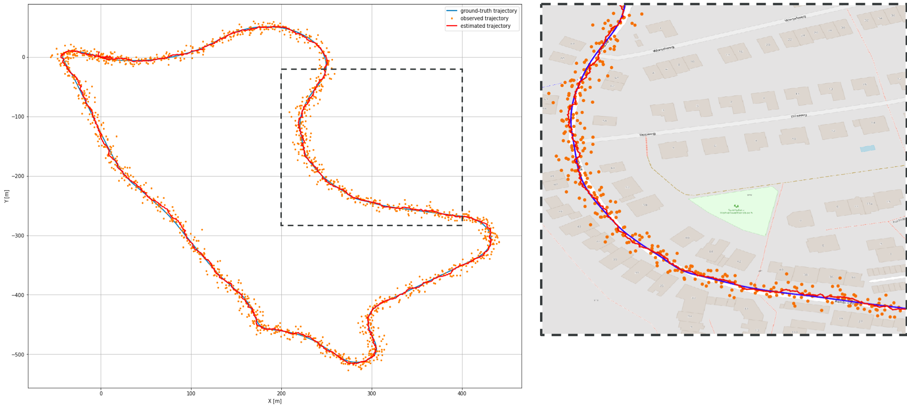

# kalman_filter_with_kitti

Providing simple Python scripts appling extended Kalman filter 
to KITTI GPS/IMU data for vehicle localization.

See [this material](https://speakerdeck.com/motokimura/shi-jian-karumanhuiruta)(in Japanese) for more details.



## Usage

### Download KITTI RawData

```
cd kalman_filter_with_kitti
mkdir -p data/kitti
```

Donwload a set of `[synced+rectified data]` and `[calibration]`
from [KITTI RawData](http://www.cvlibs.net/datasets/kitti/raw_data.php),
and place them under `data/kitti` directory.

Though we use `2011_09_30_drive_0033` sequence in [demo.ipynb](demo.ipynb),
you can use any RawData sequence!

Then, unzip them:

```
cd data/kitti
unzip 2011_09_30_drive_0033_sync.zip
unzip 2011_09_30_calib.zip
```

### Install dependencies

```
pip install -r requirements.txt
```

### Run demo

See [demo.ipynb](demo.ipynb).
