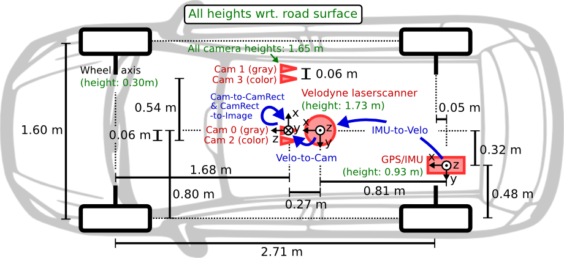

# Using the VO estimates

## Use the following code to get started

```
import pandas as pd
import numpy as np

gt = np.load("trajectory_gt_04.npy")
vo = np.load("trajectory_estimated_04.npy")
imu = np.load("imu_04.npy")
```

## Example creating a dataframe
```
imu_pd = pd.DataFrame(imu, columns=['header.stamp', 'linear_acceleration.x', 'linear_acceleration.y', 'linear_acceleration.z', 'angular_velocity.x', 'angular_velocity.y','angular_velocity.z'])
imu_pd.head()
```
## Rigid body transformations
###  You might or might not need the transformations depending on how you choose to select the sensor and its orientation.


Given the placement of the coordinates in diffrent location run this code to transform from one coordinate system to another

```
def get_rigid_transformation(calib_path):
    with open(calib_path, 'r') as f:
        calib = f.readlines()

    R = np.array([float(x) for x in calib[1].strip().split(' ')[1:]]).reshape((3, 3))
    t = np.array([float(x) for x in calib[2].strip().split(' ')[1:]])[:, None]

    T = np.vstack((np.hstack((R, t)), np.array([0, 0, 0, 1])))
    
    return T

T_velo_ref0 = get_rigid_transformation(r'calib_velo_to_cam.txt')
T_imu_velo = get_rigid_transformation(r'calib_imu_to_velo.txt')

with open('calib_cam_to_cam.txt', 'r') as f:
    calib = f.readlines()
```
## Example of conversion from one coordinate systm to another
```
T_from_imu_to_cam = T_imu_velo @ T_velo_ref0
T_from_cam_to_imu = np.linalg.inv(T_from_imu_to_cam)


imu_in_cam_coord = []
for imu_vals in imu:
    acc_imu = np.array([imu_vals[1], imu_vals[2], imu_vals[3], 1])
    gyr_imu = np.array([imu_vals[4], imu_vals[5], imu_vals[6], 1])
    transformed_acc_imu = T_from_imu_to_cam @ acc_imu
    transformed_gyr_imu = T_from_imu_to_cam @ gyr_imu
    imu_in_cam_coord.append([imu_vals[0], transformed_acc_imu[0], transformed_acc_imu[1], transformed_acc_imu[2], transformed_gyr_imu[0], transformed_gyr_imu[1], transformed_gyr_imu[2]])

cam_in_imu_coord = []
for vo_est in vo:
    VO = np.array([vo_est[0], vo_est[1], vo_est[2], 1])
    transformed = T_from_cam_to_imu @ VO
    cam_in_imu_coord.append([transformed[0], transformed[1], transformed[2]])

gt_in_imu_coord = []
for gt_est in gt.T:
    GT = np.array([gt_est[0], gt_est[1], gt_est[2], 1])
    transformed = T_from_cam_to_imu @ GT
    gt_in_imu_coord.append([transformed[0], transformed[1], transformed[2]])

imu_in_cam_coord_pd = pd.DataFrame(imu_in_cam_coord, columns=['header.stamp', 'linear_acceleration.x', 'linear_acceleration.y', 'linear_acceleration.z', 'angular_velocity.x', 'angular_velocity.y','angular_velocity.z'])
cam_in_imu_coord_pd = pd.DataFrame(cam_in_imu_coord)
gt_in_imu_coord_pd = pd.DataFrame(gt_in_imu_coord)
```